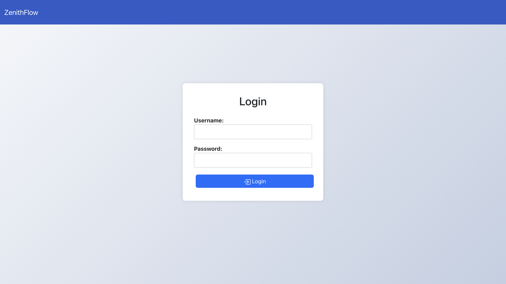
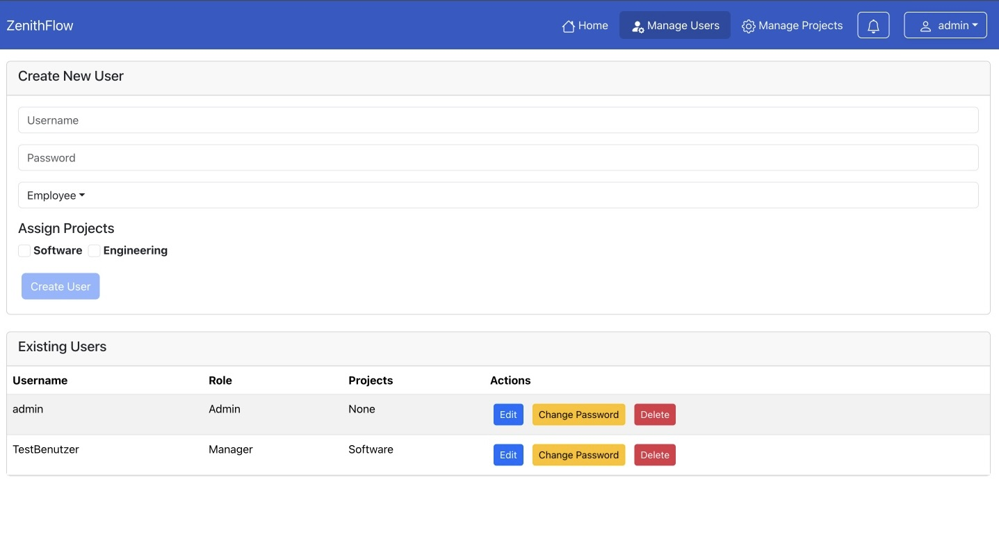
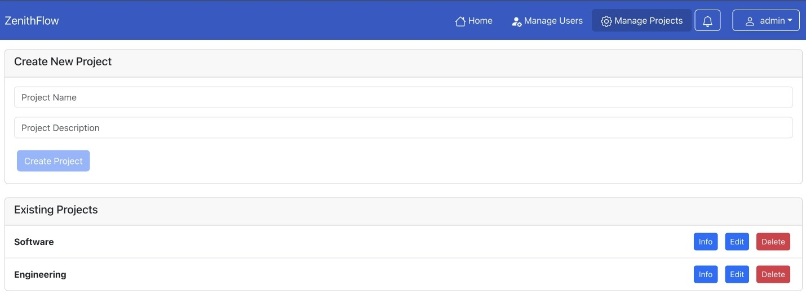
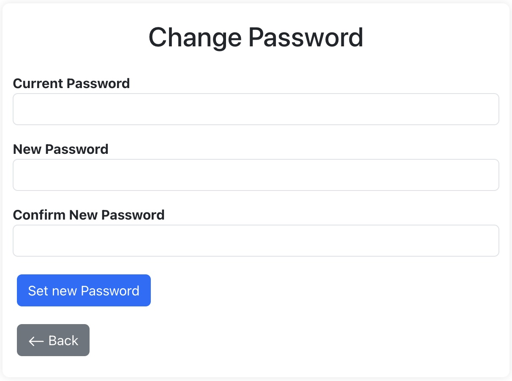
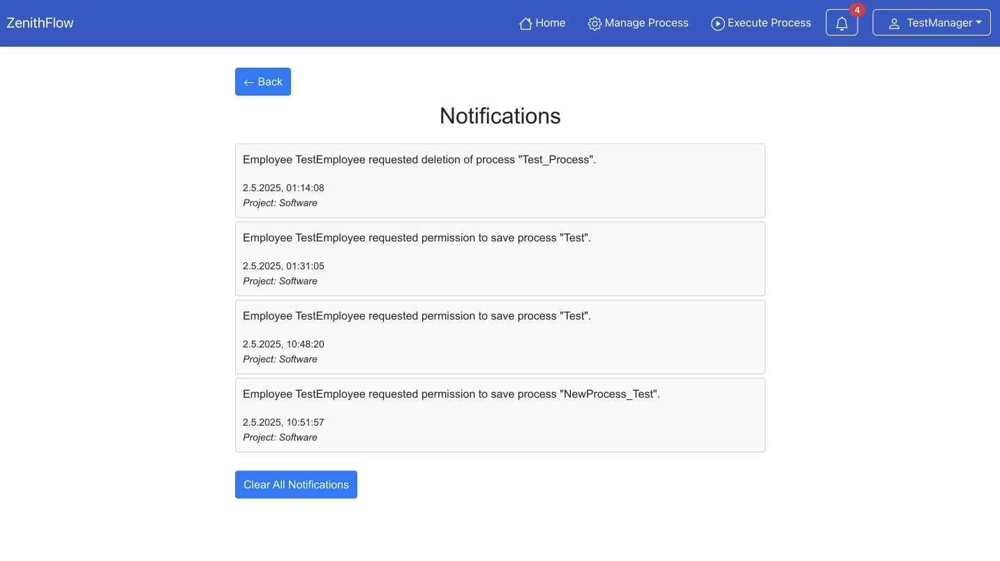
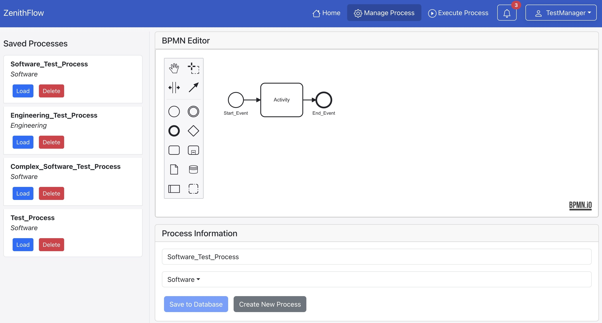
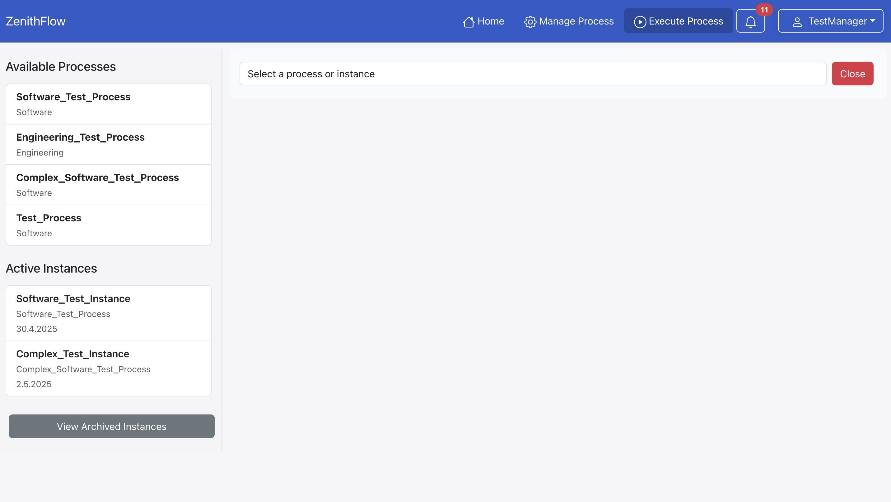

# Process Manager

A web-based tool for comprehensive process documentation, modeling, and execution.

---

## Table of Contents
1. [Overview](#overview)  
2. [Features](#features)  
3. [Technologies](#technologies)  
4. [Installation](#installation)  
5. [Usage](#usage)  
   - [Login & Roles](#login--roles)  
   - [Admin Functions](#admin-functions)  
   - [User Functions](#user-functions)  
   - [Process Modeling](#process-modeling)  
   - [Process Execution](#process-execution)  
   - [Notifications](#notifications)  
6. [License](#license)  

---

## Overview
The **Process Manager** is a full-stack application designed to let organizations document, model (via BPMN), and execute workflows in a transparent, role-based environment. It features a React front-end with an embedded BPMN editor, a Node.js/Express REST API, and MongoDB for persistence. Users can create and manage process definitions, assign roles, start process instances, and track progress through a user-friendly interface.

---

## Features
- **Process Management**  
  - Create, edit, and delete BPMN-based process definitions  
  - Drag-and-drop BPMN editor with custom attributes (role & description for each element)  
  - Validation to ensure required fields (process name, project assignment, element roles/descriptions)

- **Role-Based Access Control (RBAC)**  
  - Predefined roles: Admin, Manager, Employee  
  - Only authorized roles can perform certain actions or execute specific process events

- **Process Execution**  
  - Browse available process definitions in a list  
  - View a live, read-only preview of the selected process  
  - Start new process instances and complete events based on assigned roles  
  - Parallel execution of multiple instances, with individual event tracking

- **Notification System**  
  - In-app notifications for tasks awaiting approval or deletion requests  
  - Email alerts can be added if desired

- **Archiving & Filtering**  
  - Archive completed process instances  
  - Filter archived instances by status, project, process name, creator, or date

- **User & Project Management (Admin Only)**  
  - Create, edit, and delete user accounts (username, password, role, project assignments)  
  - Define and manage projects, and assign process definitions to projects

---

## Technologies
- **Frontend**  
  - React.js with [bpmn-js](https://github.com/bpmn-io/bpmn-js) for the BPMN editor

- **Backend**  
  - Node.js (Express)  
  - MongoDB (Mongoose)  
  - RESTful API endpoints

- **Containerization**  
  - Docker & Docker Compose

- **Authentication**  
  - JWT (JSON Web Tokens) or session-based authentication  
  - Password hashing with bcrypt

---

## Installation
1. **Clone the repository**  
   ```bash
    git clone https://github.com/DavidRaisch/dhbw5_processManager.git  
    cd dhbw5_processManager
   ```

2. **Start the application with Docker Compose**  
   Ensure you have Docker and Docker Compose installed. Then run:

   ```bash
    docker-compose up --build
   ```

   This command will build and launch three containers:  
   - **MongoDB** (with a preconfigured admin user: `admin` / `admin`)  
   - **Backend** on port `5000`  
   - **Frontend** on port `80`

3. **Access the application**  
   Open a browser and navigate to [http://localhost](http://localhost).  
   Default admin credentials:  
   ```
    Username: admin  
    Password: admin
   ```

No additional environment variables or manual configuration steps are required—everything is handled by Docker Compose.

---

## Usage

### Login & Roles
- **Login**: Users log in with a username and password.  
- **Roles**:  
  - **Admin**: Full access to user/project/process management and approvals  
  - **Manager**: Create and edit process definitions, approve deletion or change requests, manage processes within assigned projects  
  - **Employee**: Execute events in running processes according to assigned roles

  
*Example: Login Screen*

---

### Admin Functions

#### User Management
- **Create User**: Specify username, password, role, and assigned projects.  
- **Edit User**: Change password, update role or project assignments.  
- **Delete User**: Remove a user after confirmation.

  
*User Management*

#### Project Management
- **Create Project**: Provide project name and description.  
- **Edit Project**: Modify existing project details.  
- **Delete Project**: Remove a project (prompts for confirmation).

  
*Project Management*

---

### User Functions

#### Profile & Password Change
- **View Profile**: See username, role, and assigned projects.  
- **Change Password**: Update your own password with current and new password fields.

  
*Change Password*

#### Notifications
- **Notification Center**: Lists all pending notifications (deletion requests, approval requests).  
- **Review & Act**: Click into a notification to approve or reject.

  
*Notifications*

---

### Process Modeling
All users with Manager or Admin roles can create or edit processes via the BPMN editor.

1. **Access “Manage Process”** from the main navigation.  
2. **Process List** (left pane):  
   - Click **“Load”** to open an existing BPMN diagram.  
   - Click **“Delete”** to request or perform deletion (depending on role).  
3. **BPMN Editor** (right pane):  
   - Drag and drop BPMN elements (tasks, events, gateways).  
   - For each element, fill in **Role** and **Description** fields.  
   - Assign a **Process Name** and select a **Project** from the dropdown.  
   - Click **“Save to Database”** (if you have permissions) or **“Request Save”** (to send for approval).

  
*Manage Process (BPMN Editor)*

**Validation Rules**:  
- Process name and project selection are mandatory.  
- Each BPMN element must have a role and a description.  
- “Save” buttons become active only when all required fields are filled.

---

### Process Execution
All roles can view and start processes; Employees and Managers execute events.

1. **Access “Execute Process”** from the main navigation.  
2. **Process List** (left side):  
   - Search or scroll to find the desired process definition.  
   - Click once to highlight, or double-click to start a new instance.  
3. **Live Preview** (right side): Shows the process in read-only mode.  
4. **Execute Events**:  
   - Double-click an active task/event to see details, including required role and description.  
   - If the logged-in user has the required role, confirm to complete the event.  
   - If not, a notification appears with an option to request approval for that event.

  
*Execute Process*

**Key Points**:  
- Active tasks are highlighted in the diagram.  
- Users without the required role can send an approval request to a Manager or Admin directly from the event popup.

---

### Notifications
The Notification Center consolidates all in-app alerts:

- **Deletion Requests**: When a Manager or Employee requests to delete a process definition, an Admin or designated Manager sees a notification.  
- **Change Requests**: If a Manager edits a process but lacks direct save privileges, the request goes to a higher-level Manager or Admin.  
- **Execution Approval**: When an Employee lacks the role for a task, they can send a request; Managers/Admins receive the notification to approve or reject.

Notifications can be marked as “Read” once handled or clicked to view details.

---

## License
**All Rights Reserved.**  
This project and its source code are authored exclusively by the repository owner. Documentation sources are contained within the `/documentation` folder of this repository. Any external references or images used for illustration are properly attributed in the documentation files.
